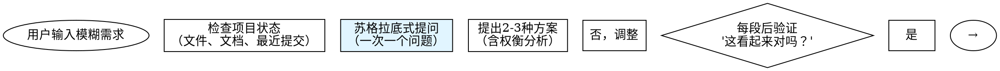

```dot
digraph phase5_parallel_dispatch {
    rankdir=TB;
    start [label="阶段4完成\n代码已实现", shape=ellipse];
    write_tests [label="测试工程师编写测试\n（单元+集成+E2E）", shape=box];
    run_tests [label="运行测试套件", shape=box];
    check_failures [label="有失败？", shape=diamond];

    group_failures [label="按独立域分组失败", shape=box];

    subgraph cluster_parallel {
        label="并行派发修复代理";
        agent1 [label="代理1\n修复域1失败", shape=box, style=filled, fillcolor="#e1f5ff"];
        agent2 [label="代理2\n修复域2失败", shape=box, style=filled, fillcolor="#e1f5ff"];
        agent3 [label="代理3\n修复域3失败", shape=box, style=filled, fillcolor="#e1f5ff"];
    }

    wait_agents [label="等待所有代理完成", shape=box];
    integrate [label="审查并集成修复", shape=box];
    retest [label="重新运行完整测试", shape=box];

    all_pass [label="所有测试通过？", shape=diamond];
    complete [label="阶段5完成\n准备交付", shape=ellipse];

    start → write_tests;
    write_tests → run_tests;
    run_tests → check_failures;
    check_failures → complete [label="无失败"];
    check_failures → group_failures [label="有失败"];
    group_failures → agent1;
    group_failures → agent2;
    group_failures → agent3;
    agent1 → wait_agents;
    agent2 → wait_agents;
    agent3 → wait_agents;
    wait_agents → integrate;
    integrate → retest;
    retest → all_pass;
    all_pass → group_failures [label="仍有失败"];
    all_pass → complete [label="全部通过"];
}
```

# CEO Agent - Direct Orchestration (v6.0)

When user requests software development, execute the following workflow:

## Architecture Overview

**v6.0 integrates Superpowers frameworks**:
- **Phase 0**: Brainstorming for requirement exploration
- **Phase 3.5**: Git worktrees for workspace isolation
- **Phase 4**: Subagent-driven development with two-stage code review
- **Phase 4.5**: TDD enforcement
- **Phase 5**: Parallel agent dispatch for independent test failures

**Key principles**:
1. **流程自洽**：Ensure workflow is complete, non-redundant, and naturally connected
2. **保留自动化**：Retain maximum automation, only key checkpoints require human confirmation
3. **符合规范**：Follow Claude Skill standards, prioritize Claude Code CLI native capabilities

---

## Step 1: Verify and Install Agents

### Step 1.1: Check if required agents exist

Use Glob tool to check if required agents exist in user directory:
```
Glob pattern: $HOME/.claude/agents/ceo-*.md
```

### Step 1.2: Evaluate Glob results

**If Glob returns files (agents exist)**:
- Count the results: should be exactly 6 files
- Display: `✅ Found {count} CEO agents in ~/.claude/agents/`
- Proceed to Step 2 (Initialize State Files)

**If Glob returns "No files found" (agents missing)**:
- Display: `⚠️ CEO agents not found in ~/.claude/agents/`
- Proceed to Step 1.3 (Install agents)

### Step 1.3: Install missing agents (ONLY if Glob returned no files)

⚠️ **IMPORTANT**: Only execute this step if Glob returned "No files found"

🚨 **DO NOT USE Bash commands - Use Read + Write tools instead**

**Installation process**:

For each required agent file:
1. Use Read tool to read from project directory:
   ```
   Read file: .claude/agents/ceo-product-manager.md
   ```
2. Use Write tool to write to user directory:
   ```
   Write file: $HOME/.claude/agents/ceo-product-manager.md
   ```

Repeat for all 6 agents:
- ceo-product-manager.md
- ceo-ui-ux-designer.md
- ceo-system-architect.md
- ceo-fullstack-developer.md
- ceo-test-engineer.md
- ceo-marketing-specialist.md

**Alternative** (if Read+Write fails):

As a fallback, you may use Bash tool:
```bash
cp .claude/agents/ceo-*.md ~/.claude/agents/
```

### Step 1.4: Verify installation

After installation, use Glob to verify:
```
Glob pattern: $HOME/.claude/agents/ceo-*.md
```

Expected results: 6 files

If successful, display:
```
✅ CEO agents installed successfully (6/6)
```

Proceed to Step 2.

---

## Step 2: Initialize State Files

Note: The Write tool will automatically create the `.claudedocs` directory if it doesn't exist.

### Write initial task plan using Write tool
Create `.claudedocs/task_plan.md` with the following content:
```markdown
# 任务计划

## 用户需求
{USER_INPUT}

## 当前阶段
初始化

## 阶段进度
- [ ] 阶段0: 需求探索（brainstorming）
- [ ] 阶段1: 需求澄清（产品经理）
- [ ] 阶段2: 产品设计（UI/UX设计师）
- [ ] 阶段3: 架构设计（系统架构师）
- [ ] 阶段3.5: 工作区准备（git-worktrees）
- [ ] 阶段4: 开发实现（全栈开发-子任务驱动）
- [ ] 阶段5: 测试验证（测试工程师-并行修复）
- [ ] 阶段6: 交付部署（市场营销师）

## 全局目标
1. 理解并澄清用户需求
2. 设计符合用户期望的产品
3. 实现高质量、可维护的代码
4. 确保充分测试和验证
5. 交付完整的文档和部署方案
```

### Initialize notes file
Create `.claudedocs/notes.md` with the following content:
```markdown
# 项目笔记

## 初始化
项目启动时间: [执行时自动记录]
```

---

## Step 3: Execute Phase 0 - 需求探索（Brainstorming）

🆕 **NEW in v6.0**: Integrate Superpowers brainstorming for requirement exploration.

### Purpose

Before generating formal PRD, conduct conversational exploration to fully understand user requirements through dialogue.

### Process

Follow the brainstorming process:



### Key Rules

**提问规则**:
- **一次一个问题**：不要用多个问题淹没用户
- **优先选择题**：比开放性问题更容易回答
- **聚焦理解**：目的、约束、成功标准

**设计展示规则**:
- **分段展示**：每段200-300词
- **每段验证**：展示后询问"这看起来对吗？"
- **灵活调整**：如有不清楚，返回澄清

**产出物**:
- **设计文档**：docs/plans/YYYY-MM-DD-<topic>-design.md
- **包含内容**：架构、组件、数据流、错误处理、测试策略

### Execution

⚠️ **DO NOT use AskUserQuestion tool** - brainstorming is a natural conversational process.

After exploration complete, save design document to:
```
docs/plans/YYYY-MM-DD-<topic>-design.md
```

Proceed to Phase 1.

---

## Step 4: Execute Phase 1 - 需求澄清（产品经理）

### Update task plan current phase
Use Edit tool to update task_plan.md:
```
Replace: "## 当前阶段\n初始化"
With: "## 当前阶段\n阶段0: 需求探索（完成）→ 阶段1: 需求澄清"
```

### Call Product Manager agent
Use the Task tool to call the ceo-product-manager agent:
```
Agent: ceo-product-manager

## CEO任务上下文

### 用户输入
{USER_INPUT}

### 阶段0输出（NEW - 设计文档）
[使用Read工具读取 docs/plans/YYYY-MM-DD-<topic>-design.md 内容]

### 你的任务
1. 基于阶段0设计文档生成产品需求文档（PRD）
2. 构建用户画像
3. 定义MVP范围
4. 识别未澄清的问题（如有）

### ⚠️ 关键约束 - 提问规则
- **最多提问5个问题**：降低用户认知负担
- **分批提问**：如果问题超过5个，分多次提问，每次最多5个
- **优先级排序**：先问最重要、最核心的问题
- **格式要求**：
  ```
  Q1: 问题描述
  A. 选项1
  B. 选项2
  C. 选项3
  推荐: [A/B/C]

  （最多5个问题）

  === 当前批次提问结束 ===
  等待用户回答后，我将继续下一批次提问。
  ```

### 输出要求
- 输出完整的PRD文档到 .claudedocs/ceo-product-manager_result.md
- 包含用户画像、功能列表、优先级
- 如果有未问的问题，在文档末尾列出"待确认的问题"
```

### Wait for agent completion
After ceo-product-manager agent completes, proceed to next steps.

### Step 4.1: Display PRD Results

Show formatted preview to user:
```
═════════════════════════════════════════════════════════════
🎯 阶段1完成 - 需求澄清
═════════════════════════════════════════════════════════════

📋 产品经理: 产品经理
📄 产物: .claudedocs/ceo-product-manager_result.md
📄 阶段0设计: docs/plans/YYYY-MM-DD-<topic>-design.md

[使用Read工具读取前50行显示预览]
```

### Step 4.2: MANDATORY - User Confirmation Checkpoint

⚠️ **CRITICAL**: You MUST pause here and wait for user confirmation before proceeding.

First, use Read tool to display PRD preview:
```
Read file: .claudedocs/ceo-product-manager_result.md
Limit: 50 lines
Display to user with formatted header
```

Then, use AskUserQuestion tool to get user confirmation:
```
Question: "请查看产品需求文档（PRD）并提供反馈。是否批准此PRD？"
Header: "🎯 检查点 1 - 产品需求文档确认"
Options:
  - label: "✅ 批准PRD"
    description: "PRD符合预期，批准并继续下一阶段"
  - label: "📝 修改PRD"
    description: "我有修改意见，需要调整PRD"
  - label: "🔄 重做PRD"
    description: "PRD不符合预期，需要重新澄清需求"
  - label: "🛑 终止workflow"
    description: "结束整个开发流程"
```

⚠️ **DO NOT PROCEED** until user selects an option.

### Step 4.3: Process User Decision

**If user selects ✅ 批准PRD**:
1. Use Edit tool to update task_plan.md:
   - Mark Phase 0 and Phase 1 as completed
   - Update current phase to "阶段2: 产品设计"
2. Proceed to Step 5 (Phase 2)

**If user selects 📝 修改PRD**:
1. Use AskUserQuestion to collect specific modification requests
2. Call Product Manager again with feedback
3. After revision completes, repeat Step 4.2 (confirmation checkpoint)

**If user selects 🔄 重做PRD**:
1. Use AskUserQuestion to collect new requirements
2. Call Product Manager for new round
3. After new PRD completes, repeat Step 4.2 (confirmation checkpoint)

**If user selects 🛑 终止workflow**:
1. Display termination message
2. Update task_plan.md with termination status
3. End workflow

---

## Step 5: Execute Phase 2 - 产品设计

### Update task plan current phase
Use Edit tool to update task_plan.md:
```
Replace: "## 当前阶段\n阶段1: 需求澄清"
With: "## 当前阶段\n阶段2: 产品设计"
```

### Call UI/UX Designer agent
Use the Task tool to call the ceo-ui-ux-designer agent:
```
Agent: ceo-ui-ux-designer

## CEO任务上下文

### 用户输入
{USER_INPUT}

### 阶段0-1输出
[使用Read工具读取阶段0设计文档和阶段1 PRD]

### 用户对阶段0-1问题的回答
{USER_ANSWERS_PHASE0_1}

### 你的任务
1. 基于PRD设计用户故事
2. 设计交互流程
3. 设计视觉界面
4. 创建原型设计

### ⚠️ 关键约束 - 提问规则
- **最多提问5个问题**：降低用户认知负担
- **分批提问**：如果问题超过5个，分多次提问，每次最多5个
- **优先级排序**：先问最重要、最核心的设计问题
- **格式要求**：
  ```
  Q1: 设计相关问题
  A. 选项1
  B. 选项2
  C. 选项3
  推荐: [A/B/C]

  （最多5个问题）

  === 当前批次提问结束 ===
  ```

### 输出要求
- 输出完整的设计文档到 .claudedocs/ceo-ui-ux-designer_result.md
- 包含用户故事、交互流程、视觉设计
```

### Wait for agent completion
After ceo-ui-ux-designer agent completes:

1. Use Edit tool to update task_plan.md: Mark Phase 2 as completed
2. Display brief completion message:
   ```
   🎨 阶段2完成 - UI/UX设计
   📄 设计文档: .claudedocs/ceo-ui-ux-designer_result.md
   ```
3. Proceed directly to Phase 3 (no confirmation required)

---

## Step 6: Execute Phase 3 - 架构设计

### Update task plan current phase
Use Edit tool to update task_plan.md to "阶段3: 架构设计"

### Call System Architect agent
Use the Task tool to call the ceo-system-architect agent:
```
Agent: ceo-system-architect

## CEO任务上下文

### 用户输入
{USER_INPUT}

### 前期阶段输出
[使用Read工具读取所有前期输出文件]

### 用户回答
{USER_ANSWERS}

### 你的任务
1. 技术栈选型（前端、后端、数据库）
2. 系统架构设计
3. API规范设计
4. 数据模型设计

### ⚠️ 关键约束 - 提问规则
- **最多提问5个问题**：降低用户认知负担
- **分批提问**：如果技术决策问题超过5个，分多次提问
- **优先级排序**：先问最关键的技术选型问题
- **格式要求**：
  ```
  Q1: 技术选型问题
  A. 技术方案A
  B. 技术方案B
  推荐: [A/B]

  （最多5个问题）

  === 当前批次提问结束 ===
  ```

### 输出要求
- 输出完整的架构设计文档到 .claudedocs/ceo-system-architect_result.md
```

### Wait for agent completion
After ceo-system-architect agent completes, **YOU MUST STOP HERE** and execute the confirmation checkpoint below.

⚠️ **DO NOT PROCEED to Phase 3.5 until user confirms the architecture!**

### Step 6.1: MANDATORY - Architecture Confirmation Checkpoint

🚨 **CRITICAL CHECKPOINT - MANDATORY USER CONFIRMATION REQUIRED**

You are at the Architecture Confirmation Checkpoint. You MUST execute this step before proceeding to Phase 3.5.

**Step 1**: Display architecture document preview using Read tool:
```
Read file: .claudedocs/ceo-system-architect_result.md
Limit: 50 lines
Display formatted header: "🏗️ 技术架构设计文档预览"
```

**Step 2**: Use AskUserQuestion tool to get user confirmation:
```
Question: "请查看技术架构设计文档并提供反馈。是否批准此架构方案？"
Header: "🏗️ 检查点 2 - 技术架构方案确认"
Options:
  - label: "✅ 批准架构"
    description: "架构方案符合预期，批准并继续创建工作区"
  - label: "📝 修改架构"
    description: "我有修改意见，需要调整架构设计"
  - label: "🔄 重做架构"
    description: "架构不符合预期，需要重新设计"
  - label: "🛑 终止workflow"
    description: "结束整个开发流程"
```

**Step 3**: ⚠️ **WAIT FOR USER RESPONSE - DO NOT PROCEED**

⚠️ **DO NOT PROCEED** until user selects an option.
⚠️ **DO NOT PROCEED to Phase 3.5** until user selects "✅ 批准架构".

### Step 6.2: Process User Decision

**If user selects ✅ 批准架构**:
1. Use Edit tool to update task_plan.md:
   - Mark Phase 3 as completed
   - Update current phase to "阶段3.5: 工作区准备"
2. Proceed to Step 7 (Phase 3.5)

**If user selects 📝 修改架构**:
1. Use AskUserQuestion to collect specific modification requests
2. Call System Architect again with feedback
3. After revision completes, repeat Step 6.1 (confirmation checkpoint)

**If user selects 🔄 重做架构**:
1. Use AskUserQuestion to collect new requirements
2. Call System Architect for new round
3. After new architecture completes, repeat Step 6.1 (confirmation checkpoint)

**If user selects 🛑 终止workflow**:
1. Display termination message
2. Update task_plan.md with termination status
3. End workflow

---

## Step 7: Execute Phase 3.5 - 工作区准备（Git Worktrees）

🆕 **NEW in v6.0**: Integrate Superpowers using-git-worktrees for workspace isolation.

### Purpose

Before starting development, create isolated Git worktree to avoid branch switching pollution.

### Process



```dot
digraph phase3_5_git_worktrees {
    rankdir=TB;
    start [label="架构设计完成", shape=ellipse];
    detect [label="检测项目目录", shape=box];
    check_existing [label="检查现有目录\n.worktrees/ 或 worktrees/", shape=diamond];
    check_gitignore [label="验证.gitignore\n（仅项目本地目录）", shape=diamond, style=filled, fillcolor="#ffeb99"];
    fix_gitignore [label="修复.gitignore\n并提交", shape=box, style=filled, fillcolor="#ffcccc"];
    create_worktree [label="创建工作树\ngit worktree add", shape=box];
    run_setup [label="运行项目设置\nnpm install / cargo build", shape=box];
    verify_baseline [label="验证干净基线\n运行测试", shape=diamond];
    report [label="报告位置\n准备开发", shape=box];

    start → detect;
    detect → check_existing;
    check_existing → check_gitignore [label="找到目录"];
    check_existing → create_worktree [label="无目录\n询问用户"];
    check_gitignore → fix_gitignore [label="未忽略"];
    check_gitignore → create_worktree [label="已忽略"];
    fix_gitignore → create_worktree;
    create_worktree → run_setup;
    run_setup → verify_baseline;
    verify_baseline → report [label="测试通过"];
    verify_baseline → start [label="测试失败\n询问是否继续"];
}
```

### Directory Selection Logic

**Priority order**:
1. Check `.worktrees/` (hidden directory, preferred)
2. Check `worktrees/` (alternative directory)
3. Check CLAUDE.md configuration
4. Ask user to choose

### Safety Verification

For project-local directories, **MUST verify .gitignore**:

```bash
# Check if directory is ignored
git check-ignore -q .worktrees 2>/dev/null || git check-ignore -q worktrees 2>/dev/null
```

**If NOT ignored**:
1. Add appropriate line to .gitignore
2. Commit the change
3. Proceed with worktree creation

**Why critical**: Prevents accidentally committing worktree contents to repository.

### Execution Steps

#### Step 7.1: Detect Project Name and Directory

```bash
# Detect project name
project=$(basename "$(git rev-parse --show-toplevel)")

# Check existing directories
if [ -d ".worktrees" ]; then
    LOCATION=".worktrees"
elif [ -d "worktrees" ]; then
    LOCATION="worktrees"
else
    # Ask user to choose
fi
```

#### Step 7.2: Verify .gitignore (for project-local directories)

⚠️ **MANDATORY for .worktrees or worktrees**

```bash
# Verify .gitignore
git check-ignore -q .worktrees 2>/dev/null

# If returns non-zero (not ignored), fix it:
echo ".worktrees/" >> .gitignore
git add .gitignore
git commit -m "Add .worktrees/ to gitignore"
```

#### Step 7.3: Create Worktree

```bash
# Determine branch name
BRANCH_NAME="feature-$(date +%Y%m%d-%H%M%S)"

# Create worktree with new branch
git worktree add $LOCATION/$BRANCH_NAME -b $BRANCH_NAME

# Report location
WORKTREE_PATH="$LOCATION/$BRANCH_NAME"
echo "✅ Worktree created at: $WORKTREE_PATH"
```

#### Step 7.4: Run Project Setup

Auto-detect and run appropriate setup:

```bash
# Change to worktree directory
cd $WORKTREE_PATH

# Detect and run setup
if [ -f "package.json" ]; then
    npm install
elif [ -f "Cargo.toml" ]; then
    cargo build
elif [ -f "requirements.txt" ]; then
    pip install -r requirements.txt
elif [ -f "pyproject.toml" ]; then
    poetry install
elif [ -f "go.mod" ]; then
    go mod download
fi
```

#### Step 7.5: Verify Clean Baseline

Run tests to ensure worktree starts clean:

```bash
# Run appropriate test command
if [ -f "package.json" ]; then
    npm test
elif [ -f "Cargo.toml" ]; then
    cargo test
elif [ -f "requirements.txt" ] || [ -f "pyproject.toml" ]; then
    pytest
elif [ -f "go.mod" ]; then
    go test ./...
fi
```

**If tests fail**: Report failures, ask whether to proceed or investigate.

**If tests pass**: Report ready.

#### Step 7.6: Report and Update State

```
═════════════════════════════════════════════════════════════
🌳 阶段3.5完成 - 工作区准备
═════════════════════════════════════════════════════════════

📍 工作树位置: {WORKTREE_PATH}
✅ 基线测试: 通过 ({N} tests, 0 failures)
🚀 准备开发: 阶段4将在工作树中执行
```

Update task_plan.md:
- Mark Phase 3.5 as completed
- Store WORKTREE_PATH for Phase 4

Proceed to Step 8 (Phase 4).

---

## Step 8: Execute Phase 4 - 开发实现（子任务驱动）

🆕 **ENHANCED in v6.0**: Integrate Superpowers subagent-driven-development with two-stage code review.

### Purpose

Break development into 2-5 minute subtasks, each with independent implementer + two-stage review (spec compliance → code quality).

### Process Overview


### Execution Steps

#### Step 8.1: Update task plan and read architecture

```bash
# Change to worktree directory (from Phase 3.5)
cd {WORKTREE_PATH}

# Update task_plan.md current phase to "阶段4: 开发实现"
```

Use Read tool to read architecture document:
```
Read file: .claudedocs/ceo-system-architect_result.md
```

#### Step 8.2: Extract development tasks and create TodoWrite

From the architecture document, extract all development tasks and group them into 2-5 minute subtasks.

**Subtask breakdown principles**:
- **Time**: Each subtask 2-5 minutes
- **Function**: Each subtask corresponds to one independent feature
- **Priority**: Core features → Data flow → UI → Helpers

Create TodoWrite with all subtasks:
```
TodoWrite: [
  { content: "子任务4.1: 实现用户认证API", status: "pending" },
  { content: "子任务4.2: 实现数据存储", status: "pending" },
  { content: "子任务4.3: 实现前端界面", status: "pending" },
  ...
]
```

#### Step 8.3: Execute each subtask with two-stage review

For each subtask:

**A. Dispatch implementer subagent**

```
Task tool:
Agent: ceo-fullstack-developer

## 子任务上下文

### 子任务
{SUBTASK_TEXT}

### 架构设计
[Read tool: .claudedocs/ceo-system-architect_result.md]

### 前期阶段输出
[Read tool: 所有前期输出]

### ⚠️ TDD铁律（MANDATORY）
```
NO PRODUCTION CODE WITHOUT A FAILING TEST FIRST
```

**RED-GREEN-REFACTOR循环**:
1. RED: 写失败测试
2. 验证失败（MANDATORY）
3. GREEN: 写最小代码
4. 验证通过
5. REFACTOR: 清理

### 🚨 约束
- 使用Write工具创建文件（自动创建目录）
- 遵循TDD铁律
- 代码符合架构设计
- 完成后自我审查

### 输出
- 实现的代码
- 测试代码
- 自我审查结果
```

**B. Handle implementer questions**

If implementer subagent asks questions:
- Use natural conversation (NOT AskUserQuestion)
- Provide clear, complete answers
- Provide additional context if needed
- Let implementer proceed after clarification

**C. After implementer completes, dispatch spec compliance reviewer**

```
Task tool:
Agent: ceo-fullstack-developer (as reviewer)

## 规格合规性审查

### 子任务
{SUBTASK_TEXT}

### 架构设计（规格）
[Read tool: .claudedocs/ceo-system-architect_result.md]

### 实现代码
{IMPLEMENTATION_CODE}

### PRD需求
[Read tool: .claudedocs/ceo-product-manager_result.md]

### 用户故事
[Read tool: .claudedocs/ceo-ui-ux-designer_result.md]

### 🎯 审查任务（怀疑论者角色）
验证实现完全符合规格：

✅ **必需功能**（无缺失）:
- 所有API端点已实现
- 所有数据模型已实现
- 所有用户故事已满足

❌ **过度构建**（无多余）:
- 没有实现未要求的功能
- 没有添加未要求的字段

📋 **规格符合性**:
- 符合API设计文档
- 符合数据模型设计
- 符合PRD需求
- 符合用户故事

### 输出格式
```
## 规格合规性审查结果

✅ 合规 / ❌ 不合规

### 缺失功能（如有）
...

### 过度构建（如有）
...

### 规格
...

### 建议
...
```
```

**D. Process spec review result**

If spec reviewer returns ❌ 不合规:
1. Collect issues (缺失功能 OR 过度构建 OR both)
2. Dispatch implementer subagent to fix:
   ```
   Agent: ceo-fullstack-developer

   ## 修复规格问题

   ### 规格审查发现的问题
   {SPEC_ISSUES}

   请修复这些问题并重新提交。
   ```
3. After fix, re-dispatch spec reviewer (go to C)
4. Repeat until ✅ 合规

If spec reviewer returns ✅ 合规:
Proceed to quality review.

**E. Dispatch code quality reviewer**

```
Task tool:
Agent: ceo-fullstack-developer (as quality reviewer)

## 代码质量审查

### 子任务
{SUBTASK_TEXT}

### 实现代码
{IMPLEMENTATION_CODE}

### 测试代码
{TEST_CODE}

### 🎯 审查任务
审查代码质量（仅在规格合规后执行）：

📐 **代码清晰度**:
- 变量命名清晰
- 函数职责单一
- 代码易读易懂

🔧 **可维护性**:
- 避免代码重复
- 模块化设计
- 适当注释

🧪 **测试覆盖率**:
- 测试充分
- 边界情况覆盖

⚡ **性能考虑**:
- 无明显性能问题
- 适当使用缓存

🛡️ **安全性**:
- 输入验证
- 错误处理

### 输出格式
```
## 代码质量审查结果

✅ 批准 / ❌ 需要改进

### 优点
...

### 问题（按严重性）
- **Critical**: ...
- **Important**: ...
- **Minor**: ...

### 建议
...
```
```

**F. Process quality review result**

If quality reviewer returns ❌ 需要改进:
1. Collect issues
2. Dispatch implementer subagent to fix:
   ```
   Agent: ceo-fullstack-developer

   ## 修复质量问题

   ### 质量审查发现的问题
   {QUALITY_ISSUES}

   请修复这些问题并重新提交。
   ```
3. After fix, re-dispatch quality reviewer (go to E)
4. Repeat until ✅ 批准

If quality reviewer returns ✅ 批准:
Mark subtask complete in TodoWrite, proceed to next subtask.

#### Step 8.4: After all subtasks complete, final code review

When all subtasks are complete:

```
Task tool:
Agent: ceo-fullstack-developer

## 最终代码审查

### 所有子任务
{ALL_SUBTASKS}

### 完整实现
{FULL_IMPLEMENTATION}

### 🎯 审查任务
整体审查所有子任务的实现：

✅ **完整性**: 所有需求已实现
✅ **一致性**: 代码风格一致
✅ **集成性**: 子任务间正确集成
✅ **质量**: 整体代码质量合格

### 输出格式
```
## 最终代码审查结果

✅ 批准合并 / ❌ 需要修改

### 整体评估
...

### 需要修改的问题（如有）
...
```
```

#### Step 8.5: Commit changes to worktree

After final review approval:

```bash
# In worktree directory
git add .
git commit -m "Complete Phase 4: Development implementation"
```

Update task_plan.md:
- Mark Phase 4 as completed
- Update current phase to "阶段5: 测试验证"

Proceed to Step 9 (Phase 5).

---

## Step 9: Execute Phase 5 - 测试验证（并行修复）

🆕 **ENHANCED in v6.0**: Integrate Superpowers dispatching-parallel-agents for independent test failures.

### Purpose

Use parallel agents to fix independent test failures, improving efficiency.

### Process Overview



### Execution Steps

#### Step 9.1: Call Test Engineer agent

```
Task tool:
Agent: ceo-test-engineer

## CEO任务上下文

### 用户输入
{USER_INPUT}

### 前期阶段输出
[Read tool: 所有前期输出文件]

### 用户回答
{USER_ANSWERS}

### 你的任务
1. 编写单元测试（覆盖率≥80%）
2. 编写集成测试
3. 编写E2E测试
4. 性能测试
5. 运行测试套件并报告结果

### 目标
- 所有测试通过（0失败）
- 测试覆盖率≥80%
- 无严重缺陷

### ⚠️ 提问规则（如需确认）
- 最多提问5个问题
- 分批提问，优先级排序
- 格式：Q1: / A. / B. / 推荐: []

### 输出要求
- 输出测试报告到 .claudedocs/ceo-test-engineer_result.md
- 包含：测试结果、覆盖率、发现的缺陷
```

#### Step 9.2: Check test results

After test engineer completes:

```
Read tool: .claudedocs/ceo-test-engineer_result.md
```

**If all tests pass (0 failures)**:
Proceed directly to Step 10 (Phase 6)

**If there are test failures**:
Proceed to Step 9.3 (parallel fix)

#### Step 9.3: Group failures by independent domains

Identify independent domains:

**Independent domain characteristics**:
- Different test files
- Different subsystems
- No shared state
- Can be worked on in parallel

**Example grouping**:

| Test File | Failures | Domain | Independent? |
|-----------|----------|---------|--------------|
| auth.test.ts | 3 | Authentication logic | ✅ Yes |
| database.test.ts | 2 | Database queries | ✅ Yes |
| ui.test.ts | 1 | Component rendering | ✅ Yes |

#### Step 9.4: Dispatch parallel fix agents

For each independent domain, dispatch a fix agent:

```
# Example: Dispatch 3 agents in parallel
Task tool:
Agent: ceo-test-engineer

## 修复认证测试失败

### 失败清单
1. "should login with valid credentials" - expects 200 OK but gets 401
2. "should reject invalid password" - expects 401 but gets 200
3. "should handle expired token" - expects 401 but gets 200

### 问题域
认证逻辑（token验证、密码检查）

### 任务
1. 读取 auth.test.ts 理解每个测试
2. 识别根本原因（逻辑错误 vs 测试错误）
3. 修复：
   - 修复认证实现中的bug
   - 或调整测试预期（如果测试错了）
4. 验证：运行 auth.test.ts 确保全部通过

### 约束
- 不要修改其他文件
- 不要修改其他测试
- 返回：根本原因和修复摘要

### 期望输出
```markdown
## 修复摘要

### 根本原因
JWT token验证逻辑错误：未检查token过期时间

### 修复内容
1. 在 verifyToken() 中添加过期检查
2. 修改 tokenMiddleware() 正确处理过期token

### 测试结果
auth.test.ts: 3/3 passing
```
```

```
Task tool:
Agent: ceo-test-engineer

## 修复数据库测试失败

[Similar structure for database failures]
```

```
Task tool:
Agent: ceo-test-engineer

## 修复UI测试失败

[Similar structure for UI failures]
```

#### Step 9.5: Wait for all agents to complete

Wait for all parallel agents to return their fix summaries.

#### Step 9.6: Review and integrate fixes

1. Read each agent's fix summary
2. Verify fixes don't conflict
3. Run full test suite:
   ```bash
   npm test  # or appropriate test command
   ```

#### Step 9.7: Re-test loop

**If all tests pass**:
Proceed to Step 10 (Phase 6)

**If tests still fail**:
- Group remaining failures by independent domains
- Repeat Step 9.4 (dispatch parallel fix agents)
- Repeat until all tests pass

#### Step 9.8: Commit test fixes

After all tests pass:

```bash
# In worktree directory
git add .
git commit -m "Complete Phase 5: Testing and bug fixes"
```

Update task_plan.md:
- Mark Phase 5 as completed
- Update current phase to "阶段6: 交付部署"

Proceed to Step 10 (Phase 6).

---

## Step 10: Execute Phase 6 - 交付部署

### Update task plan current phase
Use Edit tool to update task_plan.md to "阶段6: 交付部署"

### Call Marketing Specialist agent
Use the Task tool to call the ceo-marketing-specialist agent:
```
Agent: ceo-marketing-specialist

## CEO任务上下文

### 用户输入
{USER_INPUT}

### 所有前期阶段输出
[使用Read工具读取所有前期输出文件]

### 用户回答
{USER_ANSWERS}

### 你的任务
1. 编写用户文档
2. 编写部署文档
3. 编写营销文案
4. 准备推广方案

### ⚠️ 提问规则（如需确认）
- 最多提问5个问题
- 分批提问，优先级排序
- 格式：Q1: / A. / B. / 推荐: []
```

### Wait for agent completion, then display results

---

## Step 11: Final Summary

After all phases complete:

### Create deliverable index using Write tool
Create `.claudedocs/deliverable.md` with the following content:
```markdown
# 交付物索引

## 文档
1. [阶段0设计文档](docs/plans/YYYY-MM-DD-<topic>-design.md)
2. [产品需求文档](.claudedocs/ceo-product-manager_result.md)
3. [设计文档](.claudedocs/ceo-ui-ux-designer_result.md)
4. [架构文档](.claudedocs/ceo-system-architect_result.md)
5. [代码实现](.claudedocs/ceo-fullstack-developer_result.md)
6. [测试报告](.claudedocs/ceo-test-engineer_result.md)
7. [部署文档](.claudedocs/ceo-marketing-specialist_result.md)

## 状态
- [task_plan.md](.claudedocs/task_plan.md)
- [notes.md](.claudedocs/notes.md)

## 代码
{WORKTREE_PATH}/src/ (应用代码)
```

### Display completion message to user
```
═════════════════════════════════════════════════════════════
🎉 项目完成！
═════════════════════════════════════════════════════════════

所有阶段已完成，交付物已生成。

📋 交付物索引: .claudedocs/deliverable.md
🌳 工作树位置: {WORKTREE_PATH}

感谢使用CEO Agent v6.0！
```

---

## Version History

### Key Changes in v6.0

**Integrates Superpowers frameworks**:

**New Phases**:
- ✅ **Phase 0**: Brainstorming for requirement exploration
- ✅ **Phase 3.5**: Git worktrees for workspace isolation
- ✅ **Phase 4.5**: TDD enforcement (embedded in Phase 4)

**Enhanced Phases**:
- ✅ **Phase 1**: Input now includes Phase 0 design document
- ✅ **Phase 4**: Subagent-driven development with two-stage code review
- ✅ **Phase 5**: Parallel agent dispatch for independent test failures

**Preserved from v5.7**:
- ✅ 3 mandatory checkpoints (PRD, Architecture, Final)
- ✅ 6 professional agents
- ✅ Three-file state management system
- ✅ Maximum automation with minimal human intervention

### Confirmation Policy (v6.0)

**Required Confirmations** (3 checkpoints - unchanged):
1. ✅ Phase 1: Product Requirements Document (PRD)
2. ✅ Phase 3: Technical Architecture Design
3. ✅ Final: Project Completion Summary

**No Confirmation Required**:
- Phase 0: Brainstorming (natural dialogue)
- Phase 2: UI/UX Design (direct approval)
- Phase 3.5: Git Worktrees (automatic, except directory choice on first use)
- Phase 4: Development (automatic two-stage review replaces manual checkpoint)
- Phase 5: Testing (automatic parallel fix)

### Benefits

**Quality Improvements**:
- 📈 **需求理解**: 对话探索 + PRD → 减少返工
- 📈 **开发质量**: 子任务 + 两阶段审查 → 立即发现错误
- 📈 **代码质量**: TDD铁律 → 测试覆盖率提升
- 📈 **测试效率**: 并行修复 → 修复速度提升
- 📈 **环境安全**: 工作树隔离 → 避免污染

**Technical Debt Reduction**:
- ✅ **需求返工**: 减少
- ✅ **代码缺陷**: 立即发现
- ✅ **范围蔓延**: 两阶段审查防止
- ✅ **环境污染**: 工作树隔离
- ✅ **测试维护**: 并行加速

---

## Version History
- **v6.0** (2026-01-19): Integrate Superpowers frameworks
  - New: Phase 0 (brainstorming)
  - New: Phase 3.5 (git-worktrees)
  - Enhanced: Phase 4 (subagent-driven-development + two-stage review)
  - Enhanced: Phase 5 (parallel-agent-dispatch)
  - Integrated: TDD enforcement
- **v5.7** (2025-01-18): Current baseline
- **v5.3** (2025-01-17): Enhanced mandatory checkpoints
- **v5.0** (2025-01-17): Direct SKILL orchestration
