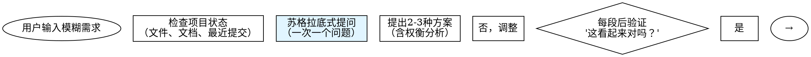

# CEO Agent - Direct Orchestration (v6.1.0)

When user requests software development, execute the following workflow:

## Architecture Overview

**v6.0 integrates Superpowers frameworks**:
- **Phase 0**: Brainstorming for requirement exploration
- **Phase 3.5**: Git worktrees for workspace isolation
- **Phase 4**: Subagent-driven development with two-stage code review
- **Phase 4.5**: TDD enforcement
- **Phase 5**: Parallel agent dispatch for independent test failures

**Key principles**:
1. **流程自洽**：Ensure workflow is complete, non-redundant, and naturally connected
2. **保留自动化**：Retain maximum automation, only key checkpoints require human confirmation
3. **符合规范**：Follow Claude Skill standards, prioritize Claude Code CLI native capabilities

---

## Step 1: Initialize State Files

⚠️ **NOTE**: CEO agents are already installed as part of the ceo-skills plugin. No agent verification or installation is required.

Note: The Write tool will automatically create the `.claudedocs` directory if it doesn't exist.

### Write initial task plan using Write tool
Create `.claudedocs/task_plan.md` with the following content:
```markdown
# 任务计划

## 用户需求
{USER_INPUT}

## 当前阶段
初始化

## 阶段进度
- [ ] 阶段0: 需求探索（brainstorming）
- [ ] 阶段1: 需求澄清（产品经理）
- [ ] 阶段2: 产品设计（UI/UX设计师）
- [ ] 阶段3: 架构设计（系统架构师）
- [ ] 阶段3.5: 工作区准备（git-worktrees）
- [ ] 阶段4: 开发实现（全栈开发-子任务驱动）
- [ ] 阶段5: 测试验证（测试工程师-并行修复）
- [ ] 阶段6: 交付部署（市场营销师）

## 全局目标
1. 理解并澄清用户需求
2. 设计符合用户期望的产品
3. 实现高质量、可维护的代码
4. 确保充分测试和验证
5. 交付完整的文档和部署方案
```

### Initialize notes file
Create `.claudedocs/notes.md` with the following content:
```markdown
# 项目笔记

## 初始化
项目启动时间: [执行时自动记录]
```

---

## Step 2: Detect Current Phase and Resume

⚠️ **CRITICAL**: Before starting any phase, check if there's an existing workflow to resume.

### Check for existing task plan

Use Read tool to check if task plan exists:
```
Read file: .claudedocs/task_plan.md
```

### If task_plan.md exists (Resume Mode)

1. **Parse current phase**: Read "## 当前阶段" section
2. **Check progress**: Read "## 阶段进度" to see completed phases
3. **Jump to next phase**: Use the mapping below

**Phase mapping**:
```
"初始化" OR "阶段0: 需求探索" → Go to Step 3 (Phase 0)
"阶段1: 需求澄清" → Go to Step 4 (Phase 1)
"阶段2: 产品设计" → Go to Step 5 (Phase 2)
"阶段3: 架构设计" → Go to Step 6 (Phase 3)
"阶段3.5: 工作区准备" → Go to Step 7 (Phase 3.5)
"阶段4: 开发实现" → Go to Step 8 (Phase 4)
"阶段5: 测试验证" → Go to Step 9 (Phase 5)
"阶段6: 交付部署" → Go to Step 10 (Phase 6)
```

Display resume message:
```
═════════════════════════════════════════════════════════════
🔄 恢复工作流
═════════════════════════════════════════════════════════════

检测到现有任务计划，将从 {CURRENT_PHASE} 继续执行。
```

Then jump to the appropriate step above.

### If task_plan.md doesn't exist (Fresh Start)

Display initialization message:
```
═════════════════════════════════════════════════════════════
🚀 启动新的 CEO 工作流
═════════════════════════════════════════════════════════════

将创建新的任务计划并执行完整 6 阶段开发流程。
```

Proceed to Step 3 (Phase 0).

---

## Step 3: Execute Phase 0 - 需求探索（Brainstorming）

🆕 **NEW in v6.0**: Integrate Superpowers brainstorming for requirement exploration.

### Purpose

Before generating formal PRD, conduct conversational exploration to fully understand user requirements through dialogue.

### Process

Follow the brainstorming process:



### Key Rules

**提问规则**:
- **一次一个问题**：不要用多个问题淹没用户
- **优先选择题**：比开放性问题更容易回答
- **聚焦理解**：目的、约束、成功标准

**设计展示规则**:
- **分段展示**：每段200-300词
- **每段验证**：展示后询问"这看起来对吗？"
- **灵活调整**：如有不清楚，返回澄清

**产出物**:
- **设计文档**：`.claudedocs/phase0-design.md`
- **包含内容**：架构、组件、数据流、错误处理、测试策略

### Execution

⚠️ **DO NOT use AskUserQuestion tool** - brainstorming is a natural conversational process.

**Invoke the brainstorming skill** (from superpowers), execute it, then continue to Phase 1.

After brainstorming completes, save design document to:
```
.claudedocs/phase0-design.md
```

Then update task_plan.md to mark Phase 0 as completed:
```
Edit: Replace "- [ ] 阶段0: 需求探索（brainstorming）"
With:  "- [x] 阶段0: 需求探索（brainstorming）"
Edit: Replace "## 当前阶段\n初始化"
With: "## 当前阶段\n阶段0: 需求探索（完成）"
```

Proceed to Phase 1.

```
═════════════════════════════════════════════════════════════
✅ Phase 0 完成 - 需求探索
═════════════════════════════════════════════════════════════

📄 设计文档: .claudedocs/phase0-design.md
📋 下一步: Phase 1 - 需求澄清（产品经理）
```

---

## Step 4: Execute Phase 1 - 需求澄清（产品经理）

### ⚠️ MANDATORY: Read Previous Phase Output

Before executing this phase, you MUST read all previous outputs:
```
Read file: .claudedocs/phase0-design.md
```

This ensures you have complete context from Phase 0.

### Update task plan current phase
Use Edit tool to update task_plan.md:
```
Replace: "## 当前阶段\n初始化"
With: "## 当前阶段\n阶段1: 需求澄清"
```

### Call Product Manager agent

⚠️ **IMPORTANT**: Execute the following steps in order to ensure the agent completes BEFORE the confirmation checkpoint.

**Step 1: Launch agent**
```
Task tool: Launch the ceo-product-manager agent with the following context:

## CEO任务上下文

### 用户输入
{USER_INPUT}

### 阶段0输出（NEW - 设计文档）
[使用Read工具读取 .claudedocs/phase0-design.md 内容]

### 你的任务
1. 基于阶段0设计文档生成产品需求文档（PRD）
2. 构建用户画像
3. 定义MVP范围
4. 识别未澄清的问题（如有）

### ⚠️ 关键约束 - 提问规则
- **最多提问5个问题**：降低用户认知负担
- **分批提问**：如果问题超过5个，分多次提问，每次最多5个
- **优先级排序**：先问最重要、最核心的问题

### 输出要求
- 输出完整的PRD文档到 .claudedocs/ceo-product-manager_result.md
- 包含用户画像、功能列表、优先级
- 如果有未问的问题，在文档末尾列出"待确认的问题"

Save the returned task_id as {PRODUCT_MANAGER_TASK_ID}
```

**Step 2: Wait for agent completion**
```
TaskOutput: Wait for {PRODUCT_MANAGER_TASK_ID}
Parameters: block=true, timeout=300000

⚠️ CRITICAL: DO NOT PROCEED until agent completes
⚠️ DO NOT proceed to confirmation checkpoint until this step completes
```

**Step 3: Verify output file exists**
```
Read file: .claudedocs/ceo-product-manager_result.md

⚠️ If file doesn't exist, agent failed - inform user and ask what to do
```

After agent completes and output is verified, proceed to confirmation checkpoint below.

### Step 4.2: MANDATORY - User Confirmation Checkpoint

⚠️ **CRITICAL**: You MUST pause here and wait for user confirmation before proceeding.

First, use Read tool to display PRD preview:
```
Read file: .claudedocs/ceo-product-manager_result.md
Limit: 50 lines
Display to user with formatted header: "📋 产品需求文档预览"
```

Then, use AskUserQuestion tool to get user confirmation:
```
Question: "请查看产品需求文档（PRD）并提供反馈。是否批准此PRD？"
Header: "🎯 检查点 1 - 产品需求文档确认"
Options:
  - label: "✅ 批准PRD"
    description: "PRD符合预期，批准并继续下一阶段"
  - label: "📝 修改PRD"
    description: "我有修改意见，需要调整PRD"
  - label: "🔄 重做PRD"
    description: "PRD不符合预期，需要重新澄清需求"
  - label: "🛑 终止workflow"
    description: "结束整个开发流程"
```

⚠️ **DO NOT PROCEED** until user selects an option.

### Step 4.3: Process User Decision

**If user selects ✅ 批准PRD**:
1. Use Edit tool to update task_plan.md:
   - Mark Phase 0 and Phase 1 as completed
   - Update current phase to "阶段2: 产品设计"
2. Proceed to Step 5 (Phase 2).

```
═════════════════════════════════════════════════════════════
✅ Phase 1 完成 - 需求澄清
═════════════════════════════════════════════════════════════

📄 PRD文档: .claudedocs/ceo-product-manager_result.md
📋 下一步: Phase 2 - 产品设计（UI/UX设计师）
```

**If user selects 📝 修改PRD**:
1. Use AskUserQuestion to collect specific modification requests
2. Call Product Manager again with feedback
3. After revision completes, repeat Step 4.2 (confirmation checkpoint)

**If user selects 🔄 重做PRD**:
1. Use AskUserQuestion to collect new requirements
2. Call Product Manager for new round
3. After new PRD completes, repeat Step 4.2 (confirmation checkpoint)

**If user selects 🛑 终止workflow**:
1. Display termination message
2. Update task_plan.md with termination status
3. End workflow

---

## Step 5: Execute Phase 2 - 产品设计

### ⚠️ MANDATORY: Read Previous Phase Outputs

Before executing this phase, you MUST read all previous outputs:
```
Read file: .claudedocs/phase0-design.md
Read file: .claudedocs/ceo-product-manager_result.md
```

This ensures you have complete context from Phase 0 and Phase 1.

### Update task plan current phase
Use Edit tool to update task_plan.md:
```
Replace: "## 当前阶段\n阶段1: 需求澄清"
With: "## 当前阶段\n阶段2: 产品设计"
```

### Call UI/UX Designer agent

⚠️ **IMPORTANT**: Execute the following steps in order to ensure the agent completes BEFORE proceeding.

**Step 1: Launch agent**
```
Task tool: Launch the ceo-ui-ux-designer agent with the following context:

## CEO任务上下文

### 用户输入
{USER_INPUT}

### 阶段0-1输出
[使用Read工具读取阶段0设计文档和阶段1 PRD]

### 用户对阶段0-1问题的回答
{USER_ANSWERS_PHASE0_1}

### 你的任务
1. 基于PRD设计用户故事
2. 设计交互流程
3. 设计视觉界面
4. 创建原型设计

### ⚠️ 关键约束 - 提问规则
- **最多提问5个问题**：降低用户认知负担
- **分批提问**：如果问题超过5个，分多次提问，每次最多5个
- **优先级排序**：先问最重要、最核心的设计问题

### 输出要求
- 输出完整的设计文档到 .claudedocs/ceo-ui-ux-designer_result.md
- 包含用户故事、交互流程、视觉设计

Save the returned task_id as {UI_UX_TASK_ID}
```

**Step 2: Wait for agent completion**
```
TaskOutput: Wait for {UI_UX_TASK_ID}
Parameters: block=true, timeout=300000

⚠️ CRITICAL: DO NOT PROCEED until agent completes
```

**Step 3: Verify output file exists**
```
Read file: .claudedocs/ceo-ui-ux-designer_result.md

⚠️ If file doesn't exist, agent failed - inform user and ask what to do
```

After agent completes and output is verified:

1. Use Edit tool to update task_plan.md: Mark Phase 2 as completed
2. Proceed directly to Phase 3 (no confirmation required).

```
═════════════════════════════════════════════════════════════
✅ Phase 2 完成 - 产品设计
═════════════════════════════════════════════════════════════

📄 设计文档: .claudedocs/ceo-ui-ux-designer_result.md
📋 下一步: Phase 3 - 架构设计（系统架构师）
```

---

## Step 6: Execute Phase 3 - 架构设计

### ⚠️ MANDATORY: Read Previous Phase Outputs

Before executing this phase, you MUST read all previous outputs:
```
Read file: .claudedocs/phase0-design.md
Read file: .claudedocs/ceo-product-manager_result.md
Read file: .claudedocs/ceo-ui-ux-designer_result.md
```

This ensures you have complete context from Phase 0, 1, and 2.

### Update task plan current phase
Use Edit tool to update task_plan.md:
```
Replace: "## 当前阶段\n阶段2: 产品设计"
With: "## 当前阶段\n阶段3: 架构设计"
```

### Call System Architect agent

⚠️ **CRITICAL**: Execute the following steps in order to ensure the agent completes BEFORE the confirmation checkpoint.

**Step 1: Launch agent**
```
Task tool: Launch the ceo-system-architect agent with the following context:

## CEO任务上下文

### 用户输入
{USER_INPUT}

### 前期阶段输出
[使用Read工具读取所有前期输出文件]

### 用户回答
{USER_ANSWERS}

### 你的任务
1. 技术栈选型（前端、后端、数据库）
2. 系统架构设计
3. API规范设计
4. 数据模型设计

### ⚠️ 关键约束 - 提问规则
- **最多提问5个问题**：降低用户认知负担
- **分批提问**：如果技术决策问题超过5个，分多次提问
- **优先级排序**：先问最关键的技术选型问题

### 输出要求
- 输出完整的架构设计文档到 .claudedocs/ceo-system-architect_result.md

Save the returned task_id as {ARCHITECT_TASK_ID}
```

**Step 2: Wait for agent completion**
```
TaskOutput: Wait for {ARCHITECT_TASK_ID}
Parameters: block=true, timeout=300000

⚠️ CRITICAL: DO NOT PROCEED until agent completes
⚠️ DO NOT proceed to confirmation checkpoint until this step completes
```

**Step 3: Verify output file exists**
```
Read file: .claudedocs/ceo-system-architect_result.md

⚠️ If file doesn't exist, agent failed - inform user and ask what to do
⚠️ DO NOT proceed to confirmation checkpoint if file doesn't exist
```

After agent completes and output is verified, **YOU MUST STOP HERE** and execute the confirmation checkpoint below.

⚠️ **DO NOT PROCEED to Phase 3.5 until user confirms the architecture!**

### Step 6.1: MANDATORY - Architecture Confirmation Checkpoint

🚨 **CRITICAL CHECKPOINT - MANDATORY USER CONFIRMATION REQUIRED**

You are at the Architecture Confirmation Checkpoint. You MUST execute this step before proceeding to Phase 3.5.

**Step 1**: Display architecture document preview using Read tool:
```
Read file: .claudedocs/ceo-system-architect_result.md
Limit: 50 lines
Display formatted header: "🏗️ 技术架构设计文档预览"
```

**Step 2**: Use AskUserQuestion tool to get user confirmation:
```
Question: "请查看技术架构设计文档并提供反馈。是否批准此架构方案？"
Header: "🏗️ 检查点 2 - 技术架构方案确认"
Options:
  - label: "✅ 批准架构"
    description: "架构方案符合预期，批准并继续创建工作区"
  - label: "📝 修改架构"
    description: "我有修改意见，需要调整架构设计"
  - label: "🔄 重做架构"
    description: "架构不符合预期，需要重新设计"
  - label: "🛑 终止workflow"
    description: "结束整个开发流程"
```

**Step 3**: ⚠️ **WAIT FOR USER RESPONSE - DO NOT PROCEED**

⚠️ **DO NOT PROCEED** until user selects an option.
⚠️ **DO NOT PROCEED to Phase 3.5** until user selects "✅ 批准架构".

### Step 6.2: Process User Decision

**If user selects ✅ 批准架构**:
1. Use Edit tool to update task_plan.md:
   - Mark Phase 3 as completed
   - Update current phase to "阶段3.5: 工作区准备"
2. Proceed to Step 7 (Phase 3.5).

```
═════════════════════════════════════════════════════════════
✅ Phase 3 完成 - 架构设计
═════════════════════════════════════════════════════════════

📄 架构文档: .claudedocs/ceo-system-architect_result.md
📋 下一步: Phase 3.5 - 工作区准备（git-worktrees）
```

**If user selects 📝 修改架构**:
1. Use AskUserQuestion to collect specific modification requests
2. Call System Architect again with feedback
3. After revision completes, repeat Step 6.1 (confirmation checkpoint)

**If user selects 🔄 重做架构**:
1. Use AskUserQuestion to collect new requirements
2. Call System Architect for new round
3. After new architecture completes, repeat Step 6.1 (confirmation checkpoint)

**If user selects 🛑 终止workflow**:
1. Display termination message
2. Update task_plan.md with termination status
3. End workflow

---

## Step 7: Execute Phase 3.5 - 工作区准备（Git Worktrees）

🆕 **NEW in v6.0**: Integrate Superpowers using-git-worktrees for workspace isolation.

### Purpose

Before starting development, create isolated Git worktree to avoid branch switching pollution.

### Execution

**Invoke the using-git-worktrees skill** (from superpowers), execute it, then proceed to Step 8 (Phase 4).

The skill will:
1. Detect project directory structure
2. Verify .gitignore settings
3. Create isolated worktree at `.worktrees/` or `worktrees/`
4. Run project setup (npm install, cargo build, etc.)
5. Verify clean baseline by running tests

After worktree is ready:

1. Update task_plan.md current phase:
   ```
   Replace: "## 当前阶段\n阶段3: 架构设计"
   With: "## 当前阶段\n阶段3.5: 工作区准备"
   ```

2. Update task_plan.md progress:
```
Edit: Replace "- [ ] 阶段3.5: 工作区准备（git-worktrees）"
With:  "- [x] 阶段3.5: 工作区准备（git-worktrees）"
```

Store the WORKTREE_PATH in task_plan.md for Phase 4 use.

Proceed to Step 8 (Phase 4).

```
═════════════════════════════════════════════════════════════
✅ Phase 3.5 完成 - 工作区准备
═════════════════════════════════════════════════════════════

🌳 工作树路径: {WORKTREE_PATH}
📋 下一步: Phase 4 - 开发实现（子任务驱动）
```

## Step 8: Execute Phase 4 - 开发实现（子任务驱动）

🆕 **ENHANCED in v6.0**: Integrate Superpowers subagent-driven-development with two-stage code review.

### ⚠️ MANDATORY: Read Previous Phase Outputs

Before executing this phase, you MUST read all previous outputs:
```
Read file: .claudedocs/phase0-design.md
Read file: .claudedocs/ceo-product-manager_result.md
Read file: .claudedocs/ceo-ui-ux-designer_result.md
Read file: .claudedocs/ceo-system-architect_result.md
```

This ensures you have complete context from all previous phases.

### Execution Steps

**Step 8.1: Update task plan current phase**
```
Replace: "## 当前阶段\n阶段3.5: 工作区准备"
With: "## 当前阶段\n阶段4: 开发实现"
```

**Step 8.2: Extract development tasks from architecture**

Read the architecture document and identify all development tasks. Group them into 2-5 minute subtasks.

⚠️ **Note**: All operations should use absolute paths based on {WORKTREE_PATH}.

**Step 8.3: Invoke subagent-driven-development skill**

Use the Task tool to break down development into subtasks and execute with two-stage review:

```
Task tool: Invoke the subagent-driven-development skill (from superpowers)

Execute the skill and after completion, proceed to Step 9 (Phase 5).

The skill will:
1. Break architecture into 2-5 minute subtasks
2. For each subtask:
   - Launch ceo-fullstack-developer agent as implementer
   - Review for spec compliance
   - Review for code quality
   - Fix issues until approved
3. Final code review
4. Commit changes
```

⚠️ **TDD Enforcement**: All development MUST follow TDD:
- RED: Write failing test first
- GREEN: Write minimal code to pass
- REFACTOR: Clean up

**Step 8.4: Update task plan progress**
```
Edit: Replace "- [ ] 阶段4: 开发实现（全栈开发-子任务驱动）"
With:  "- [x] 阶段4: 开发实现（全栈开发-子任务驱动）"
Edit: Update "## 当前阶段" to "阶段5: 测试验证"
```

Proceed to Step 9 (Phase 5).

```
═════════════════════════════════════════════════════════════
✅ Phase 4 完成 - 开发实现
═════════════════════════════════════════════════════════════

💻 代码位置: {WORKTREE_PATH}/src/
📄 开发文档: .claudedocs/ceo-fullstack-developer_result.md (if exists)
📋 下一步: Phase 5 - 测试验证（测试工程师-并行修复）
```
---

## Step 9: Execute Phase 5 - 测试验证（并行修复）

🆕 **ENHANCED in v6.0**: Integrate Superpowers dispatching-parallel-agents for independent test failures.

### ⚠️ MANDATORY: Read Previous Phase Outputs

Before executing this phase, you MUST read all previous outputs:
```
Read file: .claudedocs/ceo-system-architect_result.md
Read file: .claudedocs/ceo-fullstack-developer_result.md (if exists)
```

This ensures you have complete context from architecture and development.

### Execution Steps

**Step 9.1: Update task plan current phase**
```
Replace: "## 当前阶段\n阶段4: 开发实现"
With: "## 当前阶段\n阶段5: 测试验证"
```

**Step 9.2: Call Test Engineer agent**

⚠️ **IMPORTANT**: Execute the following steps in order to ensure the agent completes BEFORE checking results.

**Step 1: Launch agent**
```
Task tool: Launch the ceo-test-engineer agent with the following task:

## 任务
1. 编写单元测试（覆盖率≥80%）
2. 编写集成测试
3. 编写E2E测试
4. 运行测试套件并报告结果

### 输出要求
- 输出测试报告到 .claudedocs/ceo-test-engineer_result.md
- 包含：测试结果、覆盖率、发现的缺陷

Save the returned task_id as {TEST_ENGINEER_TASK_ID}
```

**Step 2: Wait for agent completion**
```
TaskOutput: Wait for {TEST_ENGINEER_TASK_ID}
Parameters: block=true, timeout=600000

⚠️ CRITICAL: DO NOT PROCEED until agent completes
```

**Step 3: Verify output file exists**
```
Read file: .claudedocs/ceo-test-engineer_result.md

⚠️ If file doesn't exist, agent failed - inform user and ask what to do
```

**Step 9.3: Check test results**

Analyze the test results from the file read above:

**If all tests pass** → Proceed to Step 10 (Phase 6)

**If there are test failures** → Proceed to Step 9.4

**Step 9.4: Invoke parallel-dispatch skill**

Use the Task tool to fix failures in parallel:
```
Task tool: Invoke the parallel-dispatch skill (from superpowers)

Execute the skill and after all tests pass, proceed to Step 10 (Phase 6).

The skill will:
1. Group test failures by independent domains
2. Launch parallel ceo-test-engineer agents for each domain
3. Wait for all agents to complete
4. Review and integrate fixes
5. Re-test until all pass
```

**Step 9.5: Update task plan progress**
After all tests pass:
```
Edit: Replace "- [ ] 阶段5: 测试验证（测试工程师-并行修复）"
With:  "- [x] 阶段5: 测试验证（测试工程师-并行修复）"
Edit: Update "## 当前阶段" to "阶段6: 交付部署"
```

Proceed to Step 10 (Phase 6).

```
═════════════════════════════════════════════════════════════
✅ Phase 5 完成 - 测试验证
═════════════════════════════════════════════════════════════

📊 测试报告: .claudedocs/ceo-test-engineer_result.md
✅ 所有测试通过
📋 下一步: Phase 6 - 交付部署（市场营销师）
```

---

## Step 10: Execute Phase 6 - 交付部署

### ⚠️ MANDATORY: Read Previous Phase Outputs

Before executing this phase, you MUST read all previous outputs:
```
Read file: .claudedocs/ceo-test-engineer_result.md
```

This ensures you have complete context from testing phase.

### Update task plan current phase
Use Edit tool to update task_plan.md to "阶段6: 交付部署"

### Call Marketing Specialist agent

⚠️ **IMPORTANT**: Execute the following steps in order to ensure the agent completes BEFORE displaying results.

**Step 1: Launch agent**
```
Task tool: Launch the ceo-marketing-specialist agent with the following context:

## CEO任务上下文

### 用户输入
{USER_INPUT}

### 所有前期阶段输出
[使用Read工具读取所有前期输出文件]

### 用户回答
{USER_ANSWERS}

### 你的任务
1. 编写用户文档
2. 编写部署文档
3. 编写营销文案
4. 准备推广方案

### ⚠️ 关键约束 - 提问规则（如需确认）
- **最多提问5个问题**：降低用户认知负担
- **分批提问**：如果问题超过5个，分多次提问，每次最多5个
- **优先级排序**：先问最重要的交付相关问题

Save the returned task_id as {MARKETING_TASK_ID}
```

**Step 2: Wait for agent completion**
```
TaskOutput: Wait for {MARKETING_TASK_ID}
Parameters: block=true, timeout=300000

⚠️ CRITICAL: DO NOT PROCEED until agent completes
```

**Step 3: Verify output file exists**
```
Read file: .claudedocs/ceo-marketing-specialist_result.md

⚠️ If file doesn't exist, agent failed - inform user and ask what to do
```

After agent completes and output is verified:

1. Use Edit tool to update task_plan.md:
   - Mark Phase 6 as completed
   - Update current phase to "完成"
2. Display completion message:
   ```
   📦 阶段6完成 - 交付部署
   📄 交付文档: .claudedocs/ceo-marketing-specialist_result.md
   ```
3. Proceed to Step 11 (Final Summary)

```
═════════════════════════════════════════════════════════════
✅ Phase 6 完成 - 交付部署
═════════════════════════════════════════════════════════════

📦 交付文档: .claudedocs/ceo-marketing-specialist_result.md
📋 下一步: 生成最终交付物索引
```

---

## Step 11: Final Summary

After all phases complete:

### Create deliverable index using Write tool
Create `.claudedocs/deliverable.md` with the following content:
```markdown
# 交付物索引

## 文档
1. [阶段0设计文档](.claudedocs/phase0-design.md)
2. [产品需求文档](.claudedocs/ceo-product-manager_result.md)
3. [设计文档](.claudedocs/ceo-ui-ux-designer_result.md)
4. [架构文档](.claudedocs/ceo-system-architect_result.md)
5. [代码实现](.claudedocs/ceo-fullstack-developer_result.md)
6. [测试报告](.claudedocs/ceo-test-engineer_result.md)
7. [部署文档](.claudedocs/ceo-marketing-specialist_result.md)

## 状态
- [task_plan.md](.claudedocs/task_plan.md)
- [notes.md](.claudedocs/notes.md)

## 代码
{WORKTREE_PATH}/src/ (应用代码)
```

### Display completion message to user
```
═════════════════════════════════════════════════════════════
🎉 项目完成！
═════════════════════════════════════════════════════════════

所有阶段已完成，交付物已生成。

📋 交付物索引: .claudedocs/deliverable.md
🌳 工作树位置: {WORKTREE_PATH}

感谢使用CEO Agent v6.1.0！
```

---

## Version History

### Key Changes in v6.1.0

**Bug Fix: 强制用户确认检查点生效**

- 🐛 修复了使用 Task 工具调用 agent 时，强制检查点被跳过的问题
- ✅ 采用 TaskOutput 同步等待机制，确保 agent 完成后才进入检查点
- ✅ 修改了 5 处 agent 调用（Phase 1, 2, 3, 5, 6）
- ✅ 保留 agent 专业能力的同时，确保检查点强制执行

**技术改进**：
- 所有 agent 调用现在遵循三步流程：Launch → Wait → Verify
- 使用 `TaskOutput(task_id, block=true)` 等待 agent 完成
- 验证输出文件存在后才继续执行

### Key Changes in v6.0

**Integrates Superpowers frameworks**:

**New Phases**:
- ✅ **Phase 0**: Brainstorming for requirement exploration
- ✅ **Phase 3.5**: Git worktrees for workspace isolation
- ✅ **Phase 4.5**: TDD enforcement (embedded in Phase 4)

**Enhanced Phases**:
- ✅ **Phase 1**: Input now includes Phase 0 design document
- ✅ **Phase 4**: Subagent-driven development with two-stage code review
- ✅ **Phase 5**: Parallel agent dispatch for independent test failures

**Preserved from v5.7**:
- ✅ 3 mandatory checkpoints (PRD, Architecture, Final)
- ✅ 6 professional agents
- ✅ Three-file state management system
- ✅ Maximum automation with minimal human intervention

### Confirmation Policy (v6.0)

**Required Confirmations** (3 checkpoints - unchanged):
1. ✅ Phase 1: Product Requirements Document (PRD)
2. ✅ Phase 3: Technical Architecture Design
3. ✅ Final: Project Completion Summary

**No Confirmation Required**:
- Phase 0: Brainstorming (natural dialogue)
- Phase 2: UI/UX Design (direct approval)
- Phase 3.5: Git Worktrees (automatic, except directory choice on first use)
- Phase 4: Development (automatic two-stage review replaces manual checkpoint)
- Phase 5: Testing (automatic parallel fix)

### Benefits

**Quality Improvements**:
- 📈 **需求理解**: 对话探索 + PRD → 减少返工
- 📈 **开发质量**: 子任务 + 两阶段审查 → 立即发现错误
- 📈 **代码质量**: TDD铁律 → 测试覆盖率提升
- 📈 **测试效率**: 并行修复 → 修复速度提升
- 📈 **环境安全**: 工作树隔离 → 避免污染

**Technical Debt Reduction**:
- ✅ **需求返工**: 减少
- ✅ **代码缺陷**: 立即发现
- ✅ **范围蔓延**: 两阶段审查防止
- ✅ **环境污染**: 工作树隔离
- ✅ **测试维护**: 并行加速

---

## Version History
- **v6.0** (2026-01-19): Integrate Superpowers frameworks
  - New: Phase 0 (brainstorming)
  - New: Phase 3.5 (git-worktrees)
  - Enhanced: Phase 4 (subagent-driven-development + two-stage review)
  - Enhanced: Phase 5 (parallel-agent-dispatch)
  - Integrated: TDD enforcement
- **v5.7** (2025-01-18): Current baseline
- **v5.3** (2025-01-17): Enhanced mandatory checkpoints
- **v5.0** (2025-01-17): Direct SKILL orchestration
